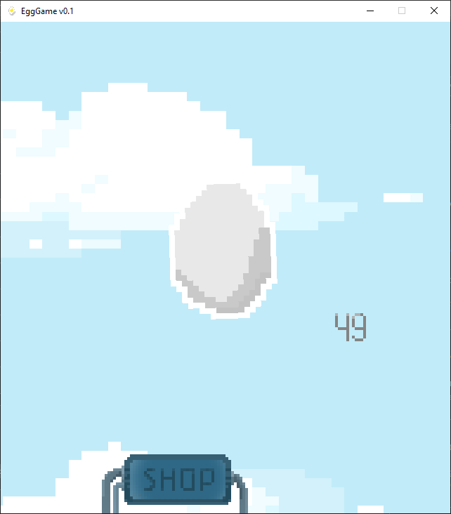

# egg-clicker
a common and generic game built with libgdx framework.

first alpha version from actually working game.

this game use gradle as the build system.

alunos: Jader Theisges, José Medeiros, Gustavo Casagrande e Gabriel Silveira.
